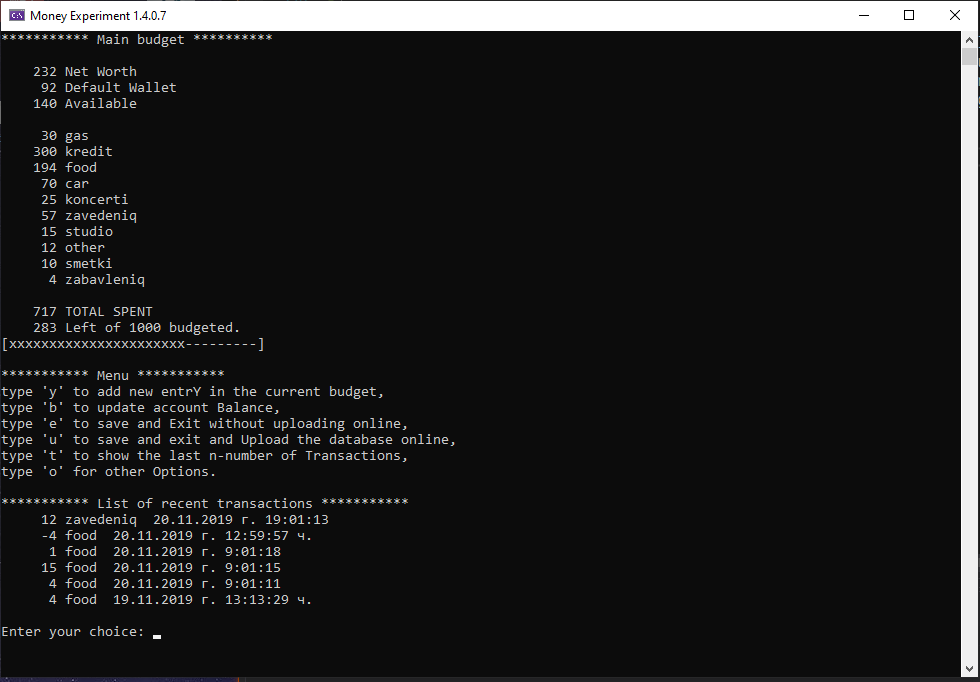

# MoneyExperiment

Experimental budgeting app.  
Sync a budget between PCs with the help of public Git repo.  
The trick is that your database of items is always encrypted even if its in a public repo.  
  

### How to Run:

* Install [git as global app](https://git-scm.com/downloads).
* If you want to build from source - Install [dotnet core 3.0](https://dotnet.microsoft.com/download/dotnet-core/3.0).
* Create an empty folder and download and extract the latest version.
* Create a new account and/or repository in [github.com](https://github.com/) or [gitlab.com](https://gitlab.com/). 
* Open Scripts/InitCreateDB.bat using your favorite text editor (notepad) and change the lines of the file to match your repo and credentials you used to make it, for example: git config user.name "Krasen Ivanov"
git config user.email "krasen007@gmail.com" and git remote add origin https://github.com/Krasen007/MoneyExperimentDB.git
* If building from, source open your folder with the app and open cmd/terminal and type "dotnet run" to compile and run.
* You are done! Enjoy your console .net core budgeting app.
* Optional: Repeat on any other PC you want to use the app on and synchronize your settings.

### How to use:

* After starting, the app will ask you to set a password. Remember this. It's used to encrypt your database. 
If you forget your password you will have to delete the Database folder containing all of the entries.  
* After that, it will ask you to set a name and amount of the budget. For example: name - Monthly Budget, amount - 1000, or Wedding Expenses 12500.
* The menu will appear. Use "y" to add entries. Enter how much you spent and on what.
* You can add new items and if you add the same item their balance will increase automatically. Use **-amount** to decrease costs of already added item.
* You can change the name of the budget and amount in the other options menu, also you can create and delete new budgets, export the database to readable txt file, or import a budget.csv with "item, cost" format for example: "food, 50".
* When you are done you can save your current account database on your PC, and/or you can upload it to your git repo.
* If you want to use the app on another PC, install git and run CloneDB.bat after you set your git repo in the file as explained above. It should automatically sync your database. Remember to use the same password or you will not be able to open the encrypted database.

### Credits:

* Main coding: Krasen Ivanov 2019
* Icon made by Freepik from www.flaticon.com

#### Whats new in version 1.3.x:

Added option to change budget name and amount;  
Added option to delete the database;  
Added option to create and switch between multiple budgets;  
Added option to record all made and deleted transactions;  
